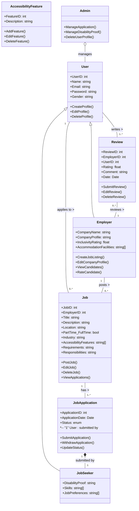

# IncluWork: Empowering Differently Abled Individuals in the Workforce

## Description

IncluWork is a comprehensive full-stack web application designed to address human rights and equality issues as outlined by the UN. Our platform connects differently abled job seekers with inclusive employers, facilitating employment opportunities and promoting diversity in the workforce.

## Table of Contents

- [Users](#users)
- [Technologies Used](#technologies-used)
- [Feature Highlights](#feature-highlights)
- [Addressing Global Issues](#addressing-global-issues)
- [Getting Started](#getting-started)
- [Object Model](#object-model)
- [REST API Resources and User Stories](#rest-api-resources-and-user-stories)


## Users

IncluWork targets two main user groups:

- **Job Seekers**: Differently abled individuals looking for employment opportunities.
- **Employers**: Companies committed to diversity and inclusivity, offering job opportunities and accommodations for differently abled individuals.

## Technologies Used

- **Frontend**: React.js
- **Backend**: Node.js with Express.js
- **Database**: MongoDB

## Feature Highlights

- User Profiles
- Job Listings
- Application Management
- Admin Verification
- Skill Matching

## Addressing Global Issues

IncluWork directly addresses global issues related to human rights and equality, particularly focusing on the employment of differently abled individuals. By providing a platform where job seekers and inclusive employers can connect, the application promotes diversity and inclusivity in the workforce, aligning with the UN's initiatives for equal opportunities and rights for all individuals.

## Getting Started

### Prerequisites

- Node.js (v14 or later)
- MongoDB
- Git

### Installation

1. Clone the repository:
   ```bash
   git clone https://github.com/your-repo/incluwork.git
   cd incluwork
   ```
2. Set up the backend:
    ```bash
    cd incluwork-service
    npm install
    ```
3. Set up the frontend:
    ```bash
    cd ../incluwork-app
    npm install
    ```
4. Configure the environment variables: In the incluwork-service directory, create a .env file with the following content:
    ```bash
    PORT=3000
    MONGO_CONNECTION="<Connection-String>"
    ```
Replace <Connection-String> with your MongoDB connection string.

5. Running the Application: 

Start the backend server:

```bash
cd incluwork-service
npm run start
```
In a new terminal, start the frontend application:

```bash
cd ../incluwork-app
npm run dev
```
6. Open your browser and navigate to http://localhost:3002

## Object Model



## REST API resources and the User stories

### Feature: Job Seeker Profile Management

- **User Story:** As a job seeker, I want to create my profile to apply for job listings.
  - Endpoint: POST /jobseekers

- **User Story:** As a job seeker, I want to view my profile to review or update my personal information and qualifications.
  - Endpoint: GET /jobseekers/{userID}

- **User Story:** As a job seeker, I want to update my profile to keep my personal information and qualifications current.
  - Endpoint: PUT /jobseekers/{userID}

- **User Story:** As a job seeker, I want to delete my profile if I no longer need to use the platform.
  - Endpoint: DELETE /jobseekers/{userID}

### Feature: Job Application Tracking

- **User Story:** As a job seeker, I want to view all my job applications to track their status and manage my job search effectively.
  - Endpoint: GET /jobseekers/{userID}/applications

### Feature: Job Listings Management

- **User Story:** As an employer, I want to post a new job listing to find qualified candidates for my open positions.
  - Endpoint: POST /jobs

- **User Story:** As a user, I want to view available job listings to find positions that match my skills and interests.
  - Endpoint: GET /jobs

- **User Story:** As an employer, I want to edit the details of my job listing to ensure it is accurate and up-to-date.
  - Endpoint: PUT /jobs/{jobID}

### Feature: Job Application Process

- **User Story:** As a job seeker, I want to withdraw my job application if I am no longer interested in the job or have accepted another offer.
  - Endpoint: DELETE /jobapplications/{applicationID}

- **User Story:** As a job seeker, I want to apply for a job listing to pursue employment opportunities.
  - Endpoint: POST /jobapplications

### Feature: Employer Profile Management

- **User Story:** As an employer, I want to create my company profile to attract potential candidates and showcase my company culture and values.
  - Endpoint: POST /employers

- **User Story:** As a user, I want to view an employer's profile to learn more about the company and its employment opportunities.
  - Endpoint: GET /employers/{employerID}

- **User Story:** As an employer, I want to update my company profile to keep information current and appealing to job seekers.
  - Endpoint: PUT /employers/{userID}


### Feature: User and Role Management

- **User Story:** As an admin, I want to create user accounts and assign roles to streamline the onboarding process and ensure users have appropriate access.
  - Endpoint: POST /admin/users

### Feature: Application Oversight

- **User Story:** As an admin, I want to view all job applications to oversee the job application process and ensure it runs smoothly.
  - Endpoint: GET /jobapplications

- **User Story:** As an admin, I want to update the status of job applications to reflect changes in their review process or outcomes.
  - Endpoint: PUT /admin/jobapplications/{applicationID}

### Feature: User Profile Management

- **User Story:** As an admin, I want to delete any user profile that violates platform policies or upon user request to maintain a safe and professional environment.
  - Endpoint: DELETE /admin/users/{userID}

- **User Story:** As an admin, I want to view all users to monitor the platform's user base and ensure compliance with platform policies.
  - Endpoint: GET /admin/users


